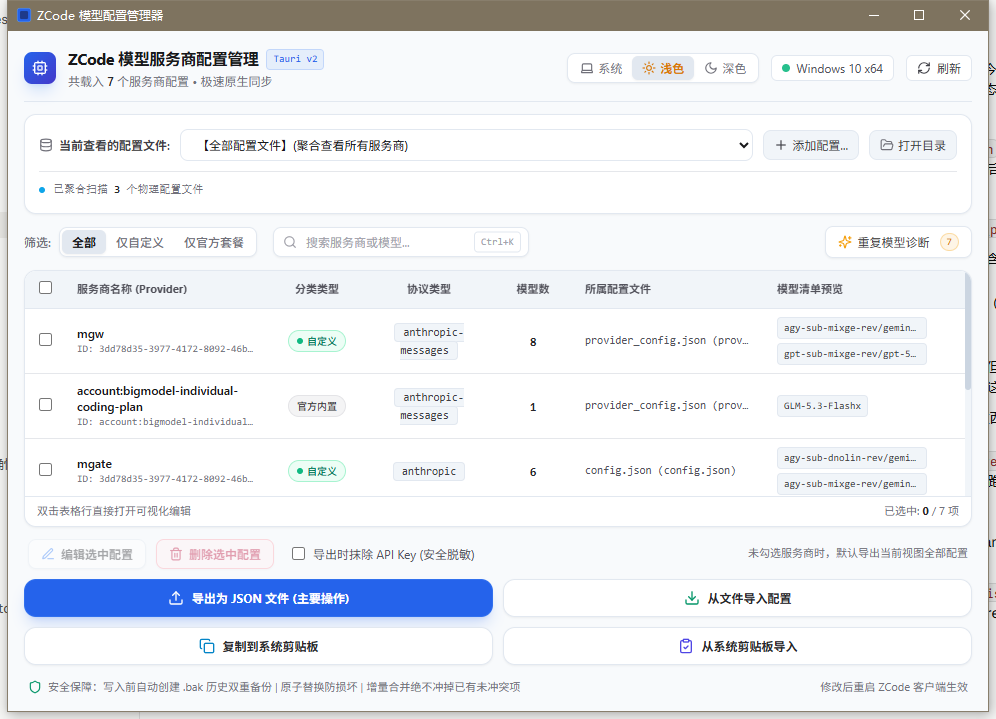
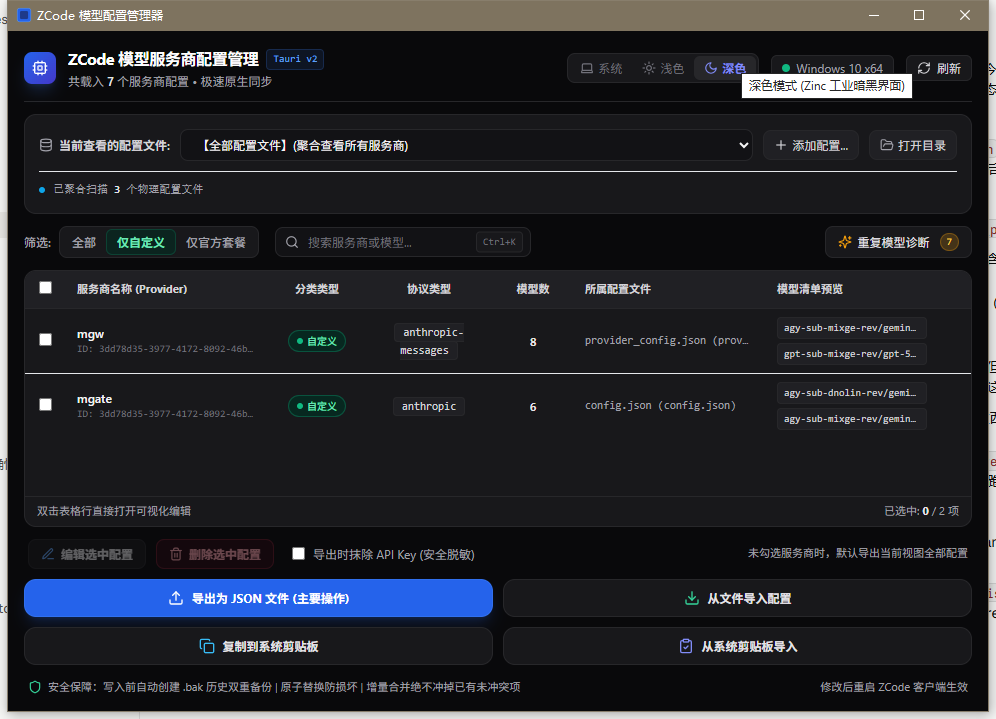
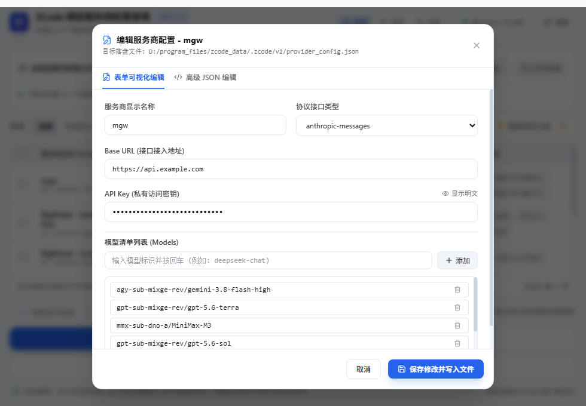
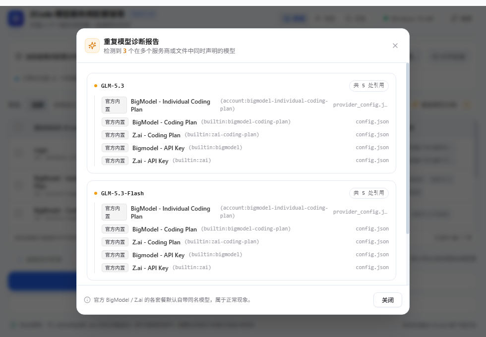

# ZCode Sync (`zcode-sync`)

[](https://tauri.app)
[](https://www.rust-lang.org)
[](https://react.dev)
[](https://tailwindcss.com)
[](https://github.com/mixyoung/zcode-sync/releases)
[](LICENSE)

> A blazing-fast (<120ms cold start), ultra-lightweight (**4.0 MB** single binary), and beautifully crafted native desktop management center for **ZCode** model providers and AI endpoints.
> Built with **Rust + Tauri v2 + React 19 + Tailwind CSS + Lucide Icons**.

---

### [📖 简体中文文档](README_zh.md)

---

## 📸 Screenshots

### Modern Dual-Theme Interface (Follows System by Default)

| ☀️ Clean Slate Light Theme | 🌙 Zinc Industrial Dark Theme |
| :---: | :---: |
|  |  |

### Visual Form & JSON Editor / Duplicate Model Diagnostics

| ✏️ Provider Visual & JSON Editor Drawer | ◈ Cross-Plan Duplicate Model Diagnostics |
| :---: | :---: |
|  |  |

---

## ✨ Key Features

- **⚡ Ultra-compact Single Binary (~4.0 MB)**:
  - Compressed from standard 12MB+ electron/python packages down to **4.0 MB** using pure Rust machine code, LTO, and system WebView2.
  - Zero Python or Node.js runtime required on target machines. Double-click and run anywhere.
- **🎨 Modern Dual Themes (Default: Follow System)**:
  - **Follow System (`system`)**: Real-time event listener via `window.matchMedia` seamlessly tracks Windows OS Light/Dark theme switching without application restarts.
  - **Manual Override (`light` / `dark`)**: Dedicated 3-segment switcher (`[ 💻 System ]` / `[ ☀️ Light ]` / `[ 🌙 Dark ]`) with smooth 150ms CSS transitions and local storage persistence.
- **🔍 Native Dual-Schema Auto-Discovery**:
  - **Schema 2 Priority (`provider_config.json`)**: Accurately recognizes active modern configuration files (e.g., custom `mgw` endpoints with detailed model rules).
  - **Schema 1 Backward Compatibility (`config.json`)**: Seamlessly reads and edits legacy `provider` dictionaries.
  - Auto-scans `ZCODE_DATA_BASE_DIR`, `ZCODE_HOME`, fixed paths, and standard `~/.zcode` directories.
- **🛡️ Bulletproof Safety & Atomic Writes**:
  - **Double Automatic Backup**: Automatically creates `.bak` and timestamped `.bak.YYYYMMDD_HHMMSS` backups before modifying any target file.
  - **Atomic Replacement**: Writes to `.tmp` first and replaces target files via OS-level atomic rename to prevent corruption during sudden power-off.
- **📝 Form & JSON Bi-directional Editing**:
  - Visual form inputs for Name, Protocol, Base URL, API Key (with plain-text visibility toggle), and model list.
  - Raw JSON code editor with real-time bidirectional synchronization.
- **◈ Cross-Plan Duplicate Model Analysis**:
  - Automatically analyzes overlapping model declarations across packages (BigModel Coding Plan, Start Plan, API Key) and custom endpoints.
- **📋 Safe Multi-Device Sync (Export & Clipboard)**:
  - Fast clipboard copy/import and file export/import.
  - One-click **"Mask API Key on Export"** to share configurations securely without leaking sensitive tokens.

---

## 🚀 Quick Start

### Option 1: Run Precompiled Portable Binary (Recommended)
Download the standalone executable directly from the repository or [Releases](https://github.com/mixyoung/zcode-sync/releases):
```text
zcode-model-sync-tauri.exe   (or release/zcode-model-sync.exe)
```
No installation needed. Double-click to launch immediately on Windows 10 (1809+) and Windows 11.

### Option 2: Run in Development Mode
Prerequisites:
- [Node.js](https://nodejs.org/) (v18+) & [pnpm](https://pnpm.io/)
- [Rust](https://rustup.rs/) (v1.75+)

```bash
# Clone the repository
git clone https://github.com/mixyoung/zcode-sync.git
cd zcode-sync

# Install frontend dependencies
pnpm install

# Start development mode (Vite HMR + Tauri Window)
pnpm dev
# in another terminal:
pnpm tauri dev
```

---

## 📦 Build from Source

To compile the single-file release binary with full optimizations (LTO, stripped symbols):

```bash
# Production single-binary build
pnpm tauri build --no-bundle
```

The resulting executable will be generated at:
```text
src-tauri/target/release/zcode-model-sync.exe   (~4.0 MB)
```

---

## 🏗️ Architecture

```text
┌────────────────────────────────────────────────────────────────────────┐
│                   Frontend Presentation Layer (React 19)               │
│  - Vite + React 19 + TypeScript + Tailwind CSS                         │
│  - Lucide Icons (100% Vector)                                          │
│  - Dual Theme CSS Variable Engine (:root Light & .dark Dark)           │
│  - HeaderNav / ConfigSelector / FilterToolbar / Table / EditModal     │
└───────────────────────────────────┬────────────────────────────────────┘
                                    │ Tauri v2 IPC (invoke)
┌───────────────────────────────────▼────────────────────────────────────┐
│                    Rust Core Engine (src-tauri)                        │
│  - path_detector: Scans candidate dirs for provider_config & config.json│
│  - sync_engine: Dual-schema parser, atomic writer, dual backup manager │
│  - models: Strongly typed Serde models (UnifiedProviderItem)          │
│  - commands: Tauri IPC command handlers                                │
└────────────────────────────────────────────────────────────────────────┘
```

---

## 📄 License

This project is open-sourced under the [MIT License](LICENSE).
