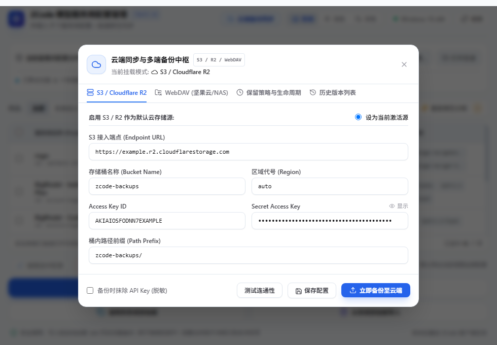

# ZCode 模型配置同步与管理中心 (`zcode-sync`)

[](https://tauri.app)
[](https://www.rust-lang.org)
[](https://react.dev)
[](https://tailwindcss.com)
[](https://github.com/mixyoung/zcode-sync/releases)
[](LICENSE)

> 一个**体积极度轻量（仅 4.5 MB）、启动极快（<120ms）、视觉质感媲美 Raycast 与 Linear** 的专业级桌面端 ZCode 模型管理中心。
> 采用 **Rust + Tauri v2 + React 19 + Tailwind CSS + Lucide 矢量图标** 架构重构，现已全面支持 **S3 / Cloudflare R2** 与 **WebDAV** 云端同步备份、生命周期保留策略、以及黑白双主题跟随系统！

---

### [📖 English Documentation](README.md)

---

## 📸 界面全貌截图

### 现代黑白双主题 (默认跟随操作系统主题)

| ☀️ 极简清爽浅色模式 (Clean Slate Light) | 🌙 工业级沉浸深色模式 (Zinc Dark) |
| :---: | :---: |
|  |  |

### 云端同步中枢 / 服务商可视化与代码双向编辑抽屉

| ☁️ S3 / Cloudflare R2 & WebDAV 云同步中枢 | ✏️ 可视化表单与高级 JSON 抽屉 |
| :---: | :---: |
|  |  |

---

## ✨ 核心特性

- **☁️ S3 / Cloudflare R2 与 WebDAV 云端备份与同步 (新特性)**：
  - **S3 / R2 兼容协议**：轻量自研 SigV4 HMAC-SHA256 签名，零冗余厚重 SDK。全面兼容 Cloudflare R2、AWS S3、MinIO、阿里云 OSS；
  - **WebDAV 协议支持**：完美支持坚果云、Nextcloud、群晖/威联通 NAS、AList；
  - **实时连通性测试**：一键握手测试存储桶或目录读写权限，弹窗提供明确排查指引。
- **⏱️ 智能生命周期与保留策略 (新特性)**：
  - **最大保留份数 (`max_versions`)**：支持设定保留最近 5 份、10 份 (默认)、20 份、50 份或不限制；
  - **最长保留天数 (`retention_days`)**：支持设定保留 7 天、30 天 (默认)、90 天、180 天或永久保留；
  - **绝对底线防空保护**：即使所有备份均已超出设定的天数，系统也绝不删除时间最近的至少 1 份完整备份，确保存储绝不为空；
  - **云端版本历史列表**：随时查看云端快照、一键智能增量拉取合并至本地，或按需手动删除。
- **⚡ 极致轻量单文件 (4.5 MB)**：
  - 彻底摆脱传统 Python 解释器与 Tcl/Tk 运行时的臃肿硬打包；
  - 采用纯 Rust 编译机器码 + 嵌入式静态资源 + 系统原生 Edge WebView2 渲染；
  - 开启 `opt-level = "z"`, `lto = true`, `strip = true` 极限瘦身优化，冷启动耗时 < 120ms。
- **🎨 黑白双主题与默认跟随系统主题**：
  - **默认跟随系统 (`system`)**：通过系统底层 `matchMedia` 实时感知 Windows 浅色/深色模式，当系统设置切换时应用**秒级无刷新平滑联动**；
  - **自由手动锁定 (`light` / `dark`)**：顶部导航栏提供直观的三段式切换控制器（`[ 💻 系统 ]` / `[ ☀️ 浅色 ]` / `[ 🌙 深色 ]`），偏好自动落盘持久化；
  - **150ms 丝滑过渡**：全组件色彩自然渐变，零闪烁。
- **🔍 原生双 Schema 配置文件自动发现**：
  - **优先识别现代核心配置 (`provider_config.json`)**：精准捕获您最新的 **`mgw`** 等活跃服务商及对应模型规则；
  - **全面兼容历史经典配置 (`config.json`)**：无缝读取早期或手动配置的 `provider` 字典；
  - 自动扫描环境变量数据目录（`ZCODE_DATA_BASE_DIR`）、`ZCODE_HOME`、Windows 固定数据目录及系统用户家目录。
- **🛡️ 安全双备份与原子覆盖落盘**：
  - 严格继承安全准则：任何修改写入前，自动生成 `.bak` 与带时间戳的 `.bak.YYYYMMDD_HHMMSS` 历史双重备份；
  - 采用临时文件写入校验通过后重命名覆盖（Atomic Rename），彻底杜绝并发或断电导致的配置损毁。
- **📝 单项可视化抽屉与代码双向编辑**：
  - 双击行即时滑出可视化编辑抽屉（表单视图 + JSON 视图双向实时校验同步）；
  - 原路安全原子落盘：精准写回原始所属文件。
- **◈ 跨套餐与跨文件重复模型诊断**：
  - 一键呼出重复模型诊断报告，清晰展示跨文件、跨套餐（Coding Plan / Start Plan / API Key）中重复声明的模型，揭示配置冗余。
- **📋 多机跨端安全同步**：
  - 支持剪贴板双向同步与 JSON 文件导入导出；
  - 支持一键开启“导出时抹除 API Key (安全脱敏)”，保护私有密钥安全。

---

## 🚀 运行方式

### 方式 1：双击运行生成的单文件绿色程序（推荐，仅 4.5 MB）
直接运行本项目生成的原生可执行程序（无需安装任何 Python、Node 或 Rust 运行库）：
```text
zcode-model-sync-tauri.exe   # 或 release/zcode-model-sync.exe
```

### 方式 2：开发模式运行 (Rust + Vite HMR)
在项目根目录下：
```bash
# 安装依赖
pnpm install

# 启动前端开发服务
pnpm dev

# 在另一个终端启动 Tauri 桌面容器
pnpm tauri dev
```

---

## 📦 生产构建打包 (编译单文件)

在项目根目录下执行：
```bash
pnpm tauri build --no-bundle
```
构建产物将自动生成于：
`src-tauri/target/release/zcode-model-sync.exe`（单文件体积约 4.5 MB）。

---

## 📄 开源许可证

本项目基于 [MIT License](LICENSE) 许可证开源。
